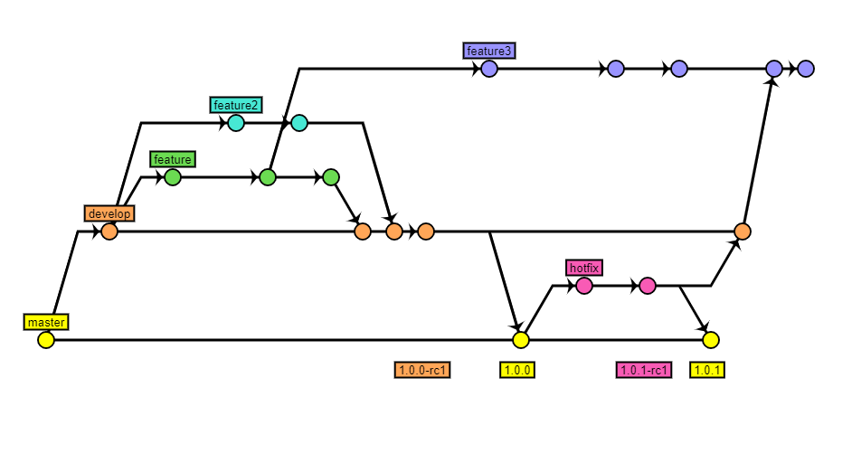

#  PBMap  

[](https://travis-ci.org/t3rmian/PBMap)
[](https://codecov.io/gh/t3rmian/PBMap)
[](https://app.codacy.com/app/t3rmian/PBMap?utm_source=github.com&utm_medium=referral&utm_content=t3rmian/PBMap&utm_campaign=Badge_Grade_Dashboard)
[](https://codeclimate.com/github/t3rmian/PBMap/maintainability)
[](https://github.com/Aaronepower/tokei)
[](https://img.shields.io/badge/Wiki-%F0%9F%93%96-blue)

PBMap is an offline map of mapped places (buildings, floors, rooms, etc.) at Bialystok University of Technology created for an Android project assignment. The application facilitates navigation by implementing positioning and routing systems. Furthermore it allows for easy searching for rooms through search bar (possible integration through Intent). A help feature and externally managed report/mapping system have been also implemented.

Main project features: Android, GPS, XML data storage, geomapping, simple communication with web-service, external integration through Intent.

The project was possible thanks to (among others) OpenStreetMap data, Stamen Design tiles and TileView library. More info can be found on the About app screen or in the NOTICE.html file.

PBMap requires Android 4.0+ and [can be downloaded from Google Play.](https://play.google.com/store/apps/details?id=io.github.t3r1jj.pbmap)

### Integration through Intent

The application has been designed to allow pinpointing places and coordinates on a map. This can be achieved by sending a search Intent to the app. To start PBMap with a search intent:

1. Define target package and class name:
````
private static final String PBMAP_PACKAGE_NAME = "io.github.t3r1jj.pbmap";
private static final String PBMAP_CLASS_NAME = "io.github.t3r1jj.pbmap.main.MapActivity";
````

2. Create an Intent with the target package/class name.
3. Set action as Intent.ACTION_SEARCH
4. Pass the data:

 a) To pinpoint a defined place:
  - put an extra String for a SearchManager.QUERY key in the following format: **place_id@map_id**
````java
Intent sendIntent = new Intent();
sendIntent.setClassName(PBMAP_PACKAGE_NAME, PBMAP_CLASS_NAME);
sendIntent.setAction(Intent.ACTION_SEARCH);

sendIntent.putExtra(SearchManager.QUERY, "12b@pb_wi");

startActivity(sendIntent);
````
b) To pinpoint a coordinate on a given map:
 - put an extra String for a SearchManager.QUERY key with **map_id**
 - put an android Location object with coordinates of indicated place for a SearchManager.EXTRA_DATA_KEY key.
````java
Intent sendIntent = new Intent();
sendIntent.setClassName(PBMAP_PACKAGE_NAME, PBMAP_CLASS_NAME);
sendIntent.setAction(Intent.ACTION_SEARCH);

sendIntent.putExtra(SearchManager.QUERY, "pb_campus");

Location customLocation = new Location("");
customLocation.setLatitude(53.11878);
customLocation.setLongitude(23.14878);

sendIntent.putExtra(SearchManager.EXTRA_DATA_KEY, customLocation);

startActivity(sendIntent);
````

If PBMap is not installed an ActivityNotFoundException exception will be thrown. The list of map and place ids can be found at [the wiki page](https://github.com/T3r1jj/PBMap/wiki/Maps-and-places) or through Content Provider. For a fully working example refer to sample app from the repository.

### Integration through Content Provider

PBMap also externalizes a read-only Content Provider, which you can use to query the list of places.

````java
/**
 * URI for acquiring Content Provider
 */
private static final String PBMAP_CONTENT_PROVIDER_URI = "content://io.github.t3r1jj.pbmap.search.SearchListProvider"; //URI for acquiring Content Provider
/**
 * URI for querying the Content Provider
 */
static final String PBMAP_CONTENT_URI = PBMAP_CONTENT_PROVIDER_URI + "/suggestions"; //URI for query
````

For more details on how to query the Content Provider and which columns are exposed, please refer to the [sample](./sample).

### Manual

[Running tests with coverage:](https://github.com/vanniktech/gradle-android-junit-jacoco-plugin)  
- unit tests: ``gradlew jacocoTestReportDebug``  
- instrumentation tests: ``gradlew createDebugCoverageReports``  
- combined tests: ``gradlew combinedTestReportDebug``  

### Contributing

Feel free to improve the app and get listed as a contributor! For bigger things It's best to create an issue first. Also, mind that I might be busy,
so for urgent things try mailing me. Any code is welcomed, especially well tested. At the moment Java and Kotlin are used interchangeably.

### Workflow

A simple workflow has been incorporated:



CI & CD are configured thanks to Travis CI and fastlane:
- unit tests and instrumentation tests (Travis CI) are run **on every branch** with code coverage reporting
- ~~instrumentation tests are run on Firebase Test Lab~~ **on master branch** and the application bundle is deployed to Google Play for internal testing  
    - the promotion from internal test track to production is done manually

Tests on Travis are run in parallel to speed up the build and meet timeout limits (50 min). There are currently 4 jobs running:
- unit and small integration tests of `:app` module
- medium integration tests of `:app` module
- large integration tests of `:app` module
- unit, integration and end to end (`:sample` on `:app`) tests of `:sample` and `:testing` modules

The `@FlakyTest` annotation is open for future use. It's recommended to keep the first job as short as possible and equalize the distribution
across `@MediumTest` and `@LargeTest`. Check our wiki for [more insights](https://github.com/t3rmian/PBMap/wiki/Test-parallelization).
You can use Travis for your own fork with the exception of deployment step (master branch).

### License

    PBMap - an interactive map of Bialystok University of Technology
    Copyright (C) 2017, 2019 Damian Terlecki

    This program is free software: you can redistribute it and/or modify
    it under the terms of the GNU Affero General Public License as published
    by the Free Software Foundation, either version 3 of the License, or
    (at your option) any later version.

    This program is distributed in the hope that it will be useful,
    but WITHOUT ANY WARRANTY; without even the implied warranty of
    MERCHANTABILITY or FITNESS FOR A PARTICULAR PURPOSE.  See the
    GNU Affero General Public License for more details.

    You should have received a copy of the GNU Affero General Public License
    along with this program.  If not, see <https://www.gnu.org/licenses/>.